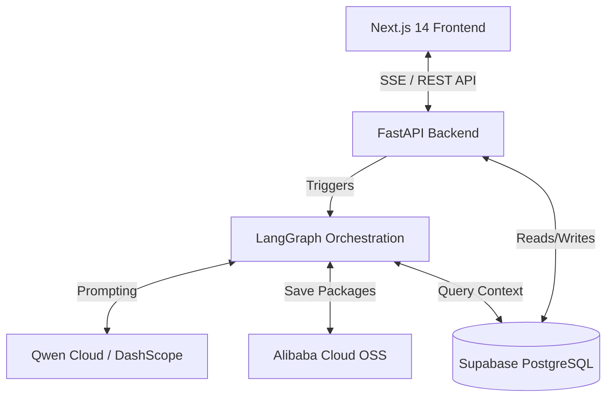

# PrismOS

**PrismOS** is an autonomous AI operating system designed to orchestrate 7 specialized agents to ship features directly into your existing product. Context-aware, conflict-resolving, and production-ready.

## 🏆 Hackathon Submission

PrismOS is our submission for the hackathon, demonstrating a fully autonomous software delivery pipeline powered by multi-agent orchestration. Key features include:
- **7-Agent Pipeline**: A LangGraph orchestrated workflow where 7 specialized agents (Analyst, PM, Architect, UI/UX, Engineer, QA, Release Manager) collaborate to write and review production code.
- **Project Memory**: The system natively retains project context, accumulating architectural decisions and constraints into Supabase to inform future agent runs.
- **Live Streaming**: Leverages Server-Sent Events (SSE) to stream the agents' internal thought processes and outputs to the Next.js frontend in real-time.

## ☁️ Proof of Alibaba Cloud Deployment

To verify our integration with Alibaba Cloud infrastructure and models, please review the following core files in our implementation:
- **Qwen / DashScope LLM Usage**: Check `backend/agents/base.py` (where our LangChain implementation natively utilizes Alibaba Dashscope models).
- **Alibaba Cloud OSS Usage**: Check `backend/storage/oss.py` (where the final codebase packages are bundled and stored securely in OSS).

## 🚀 Getting Started

### 1. Frontend Setup

First, install the frontend dependencies:

```bash
npm install
```

Then, run the development server:

```bash
npm run dev
# or
yarn dev
```

Open [http://localhost:3000](http://localhost:3000) with your browser to see the result.

### 2. Backend Setup

The backend is a Python FastAPI application. First, ensure you have Python installed, then set up your environment:

```bash
cd backend
python -m venv .venv
source .venv/bin/activate
pip install -r requirements.txt
```

Run the backend server locally:

```bash
uvicorn main:app --reload --port 8000
```

## 🧠 Architecture & Agents

### System Flow



PrismOS utilizes a suite of 7 specialized AI agents to take a feature request from concept to shippable code:

1. **Context Analyst**: Maps the existing product structure and constraints.
2. **PM Agent**: Drafts the Product Requirements Document (PRD).
3. **Architect**: Designs the system architecture and database schema.
4. **UI/UX Designer**: Produces the interface specifications and user flows.
5. **Engineer**: Writes the actual code implementation.
6. **QA**: Validates edge cases, performance, and security.
7. **Release Manager**: Resolves conflicts between agents and finalizes the package.

## 📁 Project Structure

```
prismos/
├── src/
│   ├── app/
│   │   ├── layout.tsx                       # Root layout, fonts, metadata
│   │   ├── globals.css                      # Global styles and tokens
│   │   ├── page.tsx                         # Landing page
│   │   ├── dashboard/page.tsx               # Command Center dashboard
│   │   ├── demo/page.tsx                    # Live streaming demo page
│   │   ├── projects/[projectId]/page.tsx    # Project memory and run history
│   │   ├── run/[sessionId]/page.tsx         # Live agent streaming view
│   │   └── settings/page.tsx                # System configuration
│   │
│   ├── components/
│   │   ├── landing/                         # Landing page components
│   │   ├── dashboard/                       # Dashboard UI components
│   │   ├── run/                             # Active run session panels
│   │   └── shared/                          # Reusable UI elements (Badges, Waitlist)
│   │
│   └── lib/
│       ├── api.ts                           # Backend API utility
│       ├── constants.ts                     # Configuration, agents, and pricing
│       ├── types.ts                         # Core TypeScript interfaces
│       └── useSessionToken.ts               # Anonymous session management
│
└── backend/
    ├── main.py                          # FastAPI entry point
    ├── config.py                        # Environment configurations
    ├── requirements.txt                 # Python dependencies
    ├── api/                             # FastAPI routers (runs, sessions, projects)
    ├── agents/                          # Specialized AI agent implementations
    ├── orchestration/                   # LangGraph orchestration workflows
    ├── db/                              # Supabase database integrations
    ├── storage/                         # OSS2 storage implementations
    └── memory/                          # Project memory management
```

## 🛠️ Tech Stack

### Frontend
- **Framework**: [Next.js 14](https://nextjs.org/) (App Router)
- **Styling**: [Tailwind CSS v4](https://tailwindcss.com/)
- **Animations**: [Framer Motion](https://www.framer.com/motion/)
- **Language**: [TypeScript](https://www.typescriptlang.org/)

### Backend
- **Framework**: [FastAPI](https://fastapi.tiangolo.com/)
- **AI Orchestration**: [LangGraph](https://langchain-ai.github.io/langgraph/) & [LangChain](https://python.langchain.com/)
- **Database**: [Supabase](https://supabase.com/)
- **Storage**: [Alibaba Cloud OSS](https://www.alibabacloud.com/product/oss)
- **Language**: [Python 3](https://www.python.org/)

## 🔗 Environment Variables

To connect PrismOS to a live backend, ensure you set the API base URL in your `.env.local` file:

```env
NEXT_PUBLIC_API_BASE_URL=https://api.your-backend.com/api/v1
```

If not provided, the app will fall back to its internal configuration or mock data where applicable.

## 📜 Notes

- **Hackathon Build**: Authentication is disabled. Anonymous sessions are managed via `localStorage` with `session_token`.
- **Backend Sync**: Live agent streaming relies on Server-Sent Events (SSE) via the `/runs/{id}/stream` endpoint.
